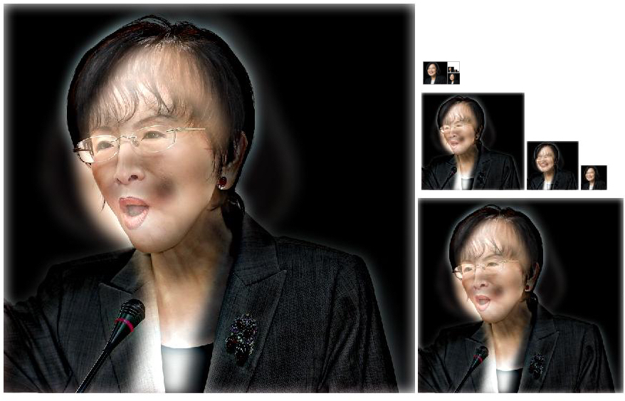
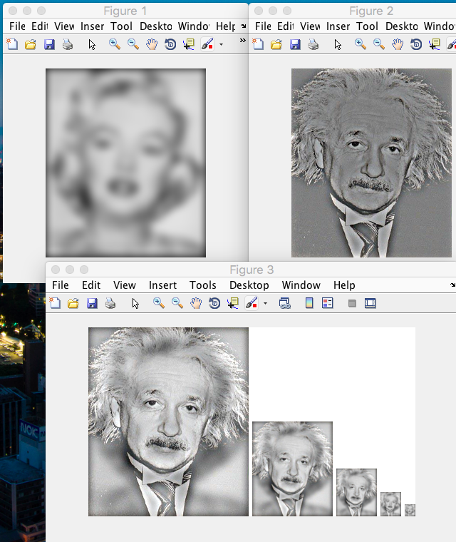
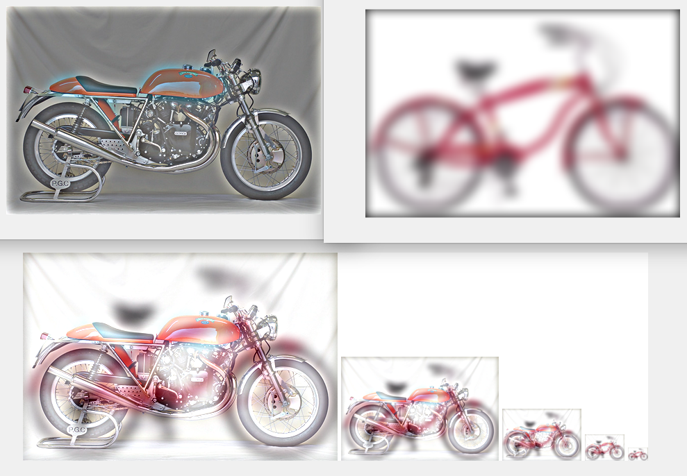
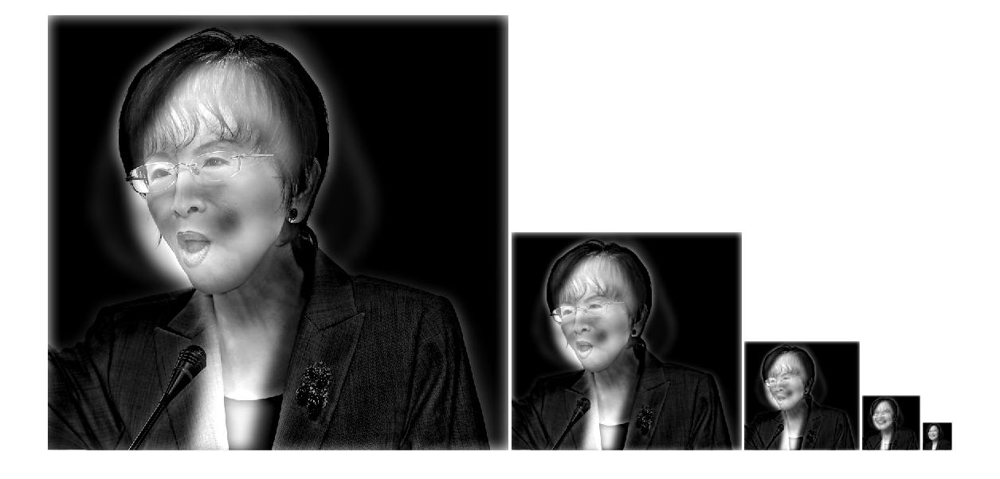

# Meng-Jiun Chiou <span style="color:red">(NCTU student)</span>

# Project 1 / Image Filtering and Hybrid Images

## Overview
This project mainly can be divided into two parts, image filtering and hybrid images.

- **Image filtering**

Filtering is a kind of process of convolution. convolution is a mathematical operation on two functions f and g, producing a third function that is typically viewed as a modified version of one of the original functions. It may occurs to people that correlation is similar. The answer is, they refer to the same thing. In fact, 2-D correlation is related to 2-D convolution by a **180 degree rotation** of the filter matrix.

There're are mainly two types of image filtering. One is high-pass filter, and the other is low-pass filter. Pictures filtered through low-pass filter (e.g. Gaussian) will be more smooth. In contrast, pictures filtered through high-pass filter will be more sharpened.

- **Hybrid image**

By hybriding the high-pass-filtered image and low-pass-filtered image, one can create a kind of special image which change its content with the distance between it and viewer changing. To be specific, one can see high-pass-filtered (sharpened) image at a short distance while seeing low-pass-filtered (smooth) image at a long distance.

## Implementation
- **Image filtering**

`my_filter.m` is a function `my_filter()` intending to behave like the built-in function `imfilter()`. The objective of this function is filtering an image. It will have input of the raw image and the specified filter and output filtered image with the same resolution and size. I'll show some essential processes in my code below.

In order to deal with the problem of that the filter can't be centered on pixels at the image boundary without parts of the filter being out of bounds, it need to be padded with zeros.

```
% Get the row & column size of input image and filter in order to admit
% multi size picture
[intput_row, intput_col] = size(intput_image(:,:,1));
[filter_row, filter_col] = size(filter);

% Pad image with zeros (amount = minimum need of filter = half of row and
% column
pad_input_image = padarray(intput_image, [(filter_row - 1)/2, (filter_col - 1)/2]);
```
Because of difficulty of implementing 2-D convolution, I make the decision to process it by twice 1-D convolution. That is, firstly convolute with vertical mask and secondly convolute with horizontal mask. In matlab, we can convolute the matrixs by using useful build-in function, `im2col` and `col2im`. Finally, output it.

```
output = [];
for layer = 1:3
    % make all filter_row*filter_col size patch of input image be columns
    columns = im2col(pad_input_image(:,:,layer), [filter_row, filter_col]);
    
    % transpose the filter in order to make it convolution (but not correlation)
    filter2 = transpose(filter(:));
    
    % filter the image
    filterd_columns = filter2 * columns;
    
    % recover from columns to image form
    output(:,:,layer) = col2im(filterd_columns, [1, 1], [intput_row, intput_col]);
end
```

- **Low-frequencies image and High-frequencies image**

At first, because of using twice 1-D gaussian filter in `my_filter()`, we need to change code in `proj1.m` to make it be 1-D filter.

`filter = fspecial('Gaussian', [cutoff_frequency*4+1 1], cutoff_frequency);`

By using Gaussian filter, one can get low-frequencies pictures. And if we would like to get high-frequencies pictures, one easy approach is just output the image subtracted by its low-frequencies image.

```
low_frequencies_image1 = my_imfilter(my_imfilter(image1, filter), filter'); 
high_frequencies_image2 = image2 - my_imfilter(my_imfilter(image2, filter), filter');
```

Consequently, we get low frequencies image and high frequencies image repectively.

- **Hybriding image**

Just plus them.

`hybrid_image = low_frequencies_image1 + high_frequencies_image2;`

## Installation
Download the repository, open your matlab and change the work folder to `homework1/code`. Then, set images path of `image1` and `image2`.

Finally, click *Run*!

## Results

I've tried 4 samples of hybriding image. First one is the hybrid image of candidates of next precident of R.O.C., Tsai Ing-Wen & Hung Hsiu-Chu. I found that by tuning the cut-off frequency one can get really different result. For example, the cut-off frequency of the first sample is set 14 (pixels).

Following pairs are bird & plane, Marilyn & Einstein and motorcycle & bicycle.

<table border=1>
<tr>
<td>


</td>
</tr>

<tr>
<td>


</td>
</tr>
</table>

For gray-scale image, I also tried it and show the result below.

<table border=1>
<tr>
<td>

</td>
</tr>
</table>
